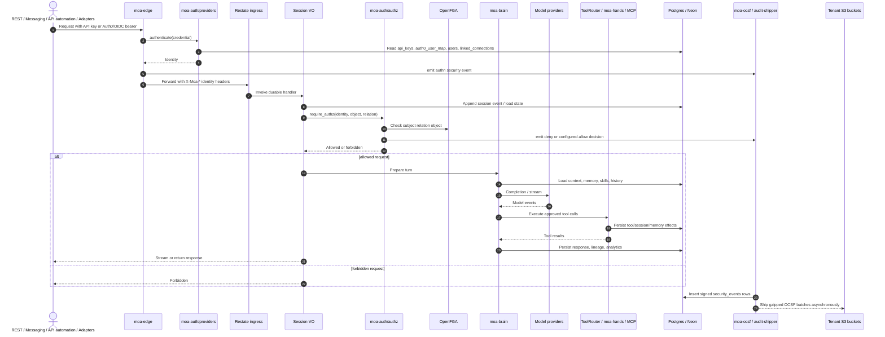
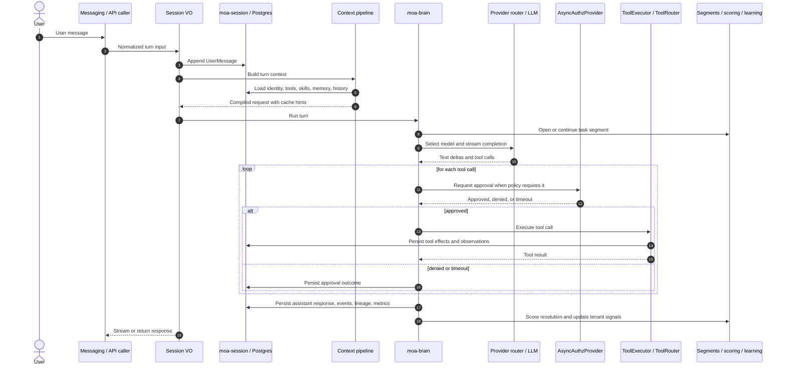

# MOA Architecture

This is the high-level map of the current MOA system. The detailed specs live in
[`docs/`](docs/); code remains the source of truth when an older design note
drifts.

MOA is now aimed at enterprise agent operations, not a personal desktop agent.
The platform model is multi-tenant, auditable, Restate-backed, and Postgres-first.
Local mode exists so engineers can develop and operate the same runtime model
through hosted HTTP APIs, not as a separate consumer product.

---

## 1. Mental Model

MOA has four durable boundaries:

1. **Runtime boundary:** callers talk through the public edge or test-only
   direct Restate ingress calls into the handler service.
2. **Brain boundary:** `moa-brain` compiles context, calls model providers, runs
   approval/tool loops, scores task resolution, and emits lineage.
3. **Execution boundary:** `moa-hands` routes built-in tools, local/Docker
   execution, Daytona, E2B, and MCP through one tool router.
4. **Data boundary:** Postgres/Neon owns the product record: sessions, events,
   graph memory, vectors, task segments, learning log, lineage,
   analytics, and audit rows.

Restate owns durable cloud orchestration. Postgres owns enterprise state and
auditability.

---

## 2. System Sequence Diagram



---

## 3. Enterprise Product Model

```text
Platform
  -> Workspace control plane
       -> Workspace-default skills and policies
       -> Tenants
            -> Users and contacts
            -> Sessions
            -> Task segments
            -> Learning log
            -> Tenant knowledge and skills
            -> Lineage, analytics, and audit evidence
```

Enterprise behavior is tenant-controlled:

- Learning is append-only and invalidated by `valid_to`, not silently rewritten.
- Knowledge and learning are tenant-scoped; tenant administration controls
  runtime policy.
- Compliance audit is an opt-in tier with explicit attestation caveats until
  external cryptographic review is complete.

---

## 4. Core Traits

Stable interfaces live in [`crates/moa-core`](crates/moa-core/).

Session orchestration is not a `moa-core` trait: it is realized as Restate
services and virtual objects in `moa-orchestrator` (see sections 5–6 and
`docs/12-restate-architecture.md`).

| Trait | Responsibility | Current implementations |
|---|---|---|
| `SessionStore` | Append-only event log, sessions, signals, snapshots, task segments, analytics, learning | `PostgresSessionStore` |
| `BlobStore` | Claim-check storage for large session artifacts | `FileBlobStore` |
| `BranchManager` | Optional database checkpoint branches | `NeonBranchManager` |
| `LLMProvider` | Completion and streaming provider interface | Anthropic, OpenAI, Gemini, scripted tests |
| `EmbeddingProvider` | Shared embedding interface | OpenAI embedding, Cohere v4, Gemini embedding, ZeroEntropy embedding, mock/test embedding |
| `HandProvider` | Provision, execute, pause, resume, destroy execution environments | local, Docker, Daytona, E2B |
| `BuiltInTool` | In-process tools with policy and schema metadata | memory, file/search/read/write, shell helpers |
| `ChannelAdapter` | Messaging normalization/rendering | Slack |
| `ContextProcessor` | Ordered context-pipeline stage | identity, agent instructions, instructions, tools, query rewrite, skills, digest, memory, history, delegation planning, runtime context, compactor |
| `CredentialVault` | Secret storage abstraction | environment-backed MCP vault, environment-backed delivery vault |
| `AuthProvider` | Resolve API keys or bearer JWTs to MOA identities | local API keys, disabled local/test mode, optional Auth0/OIDC |
| `TokenVaultProvider` | Retrieve third-party OAuth tokens for linked user connections | null provider, optional Auth0 Token Vault |
| `AsyncAuthzProvider` | Request durable human approvals | builtin approvals, optional Auth0 CIBA |
| `LineageHandle` | Transport-neutral lineage capture | null handle, async sink/OTel bridge |

---

## 5. Workspace Layout

| Crate | Role |
|---|---|
| `moa-core` | Shared types, traits, config, events, telemetry, analytics DTOs |
| `moa-brain` | Context pipeline, retrieval, turn harness, approvals, resolution scoring, lineage emission |
| `moa-db` | Database helpers shared by MOA storage crates (pools, scoped connections, RLS) |
| `moa-session` | Postgres session store, event log, snapshots, task segments, learning log, analytics |
| `moa-analytics` | Query catalog and read models for safe analytics API queries |
| `moa-runtime-store` | Runtime cache store implementations (in-memory and Redis/Valkey) |
| `moa-migrations` | Central Postgres migrations and schema runners |
| `moa-memory/graph` (`moa-memory-graph`) | Graph memory, relational node/edge tables, sidecars, RLS, changelog |
| `moa-memory/ingest` (`moa-memory-ingest`) | Slow-path ingestion and fast memory write APIs |
| `moa-memory/lifecycle` (`moa-memory-lifecycle`) | Memory consolidation, quality scoring, and digest generation |
| `moa-memory/pii` (`moa-memory-pii`) | PII classification and memory privacy helpers |
| `moa-memory/types` (`moa-memory-types`) | Shared memory domain types across the memory subcrates |
| `moa-memory/vector` (`moa-memory-vector`) | pgvector and Turbopuffer vector stores |
| `moa-knowledge` | Tenant knowledge-base domain, providers, parsers, and ingestion seams |
| `moa-lineage-core` | Lineage record types and score records |
| `moa-lineage-citation` | Provider citation normalization and answer-source verification |
| `moa-lineage-sink` | Async lineage sink writers |
| `moa-lineage-otel` | OTel/OpenInference bridge |
| `moa-lineage-audit` | Compliance audit hashes, roots, signing, and DSAR support |
| `moa-observability` | Runtime metrics, tracing bootstrap, and Restate observability helpers |
| `moa-auth/authz-schema` (`moa-authz-schema`) | Typed OpenFGA tuple keys and model constants |
| `moa-auth/authz` (`moa-authz`) | OpenFGA client, authz checks, transactional outbox, and poller |
| `moa-auth/providers` (`moa-auth-providers`) | Local API keys, disabled auth, builtin approvals, null token vault, and provider bundle |
| `moa-auth/auth0` (`moa-auth-providers-auth0`) | Optional Auth0/OIDC, Token Vault, CIBA, JWKS, and group sync |
| `moa-auth/fga-bootstrap` (`moa-fga-bootstrap`) | OpenFGA store and model bootstrap binary |
| `moa-edge` | Public HTTP edge for authn, identity headers, and Auth0 webhooks |
| `moa-ocsf` | OCSF v1.3 security-event types, signing, and persistence |
| `moa-hands` | Tool router and execution adapters |
| `moa-providers` | Provider core and vendor adapters (LLM, embedding, rerank) |
| `moa-orchestrator` | Restate objects, services, workflows, and `moa-orchestrator-bin` |
| `moa-agents` | Tenant-configurable agent resolution and runtime policy locking |
| `moa-contacts` | Contact identity domain and persistence helpers |
| `moa-artifacts` | Canonical artifact definitions for agents, skills, connectors, actions, and experiment plans |
| `moa-experiments` | Domain types for experiment runs and scorecard configuration |
| `moa-scoring` | Shared score-run storage and score summary queries |
| `moa-messaging` | Messaging adapters, platform renderers, and notification connectors |
| `moa-security` | Vaults, MCP credential proxy, policies, prompt-injection controls |
| `moa-skills` | Agent Skills parsing, distillation, improvement, and regression generation |
| `moa-eval/core` (`moa-eval-core`) | Shared evaluation engine types and scoring primitives |
| `moa-eval` | Evaluation harness |
| `moa-loadtest` | Direct HTTP load-test harness |
| `moa-test-support` | Shared test fixtures, pricing tables, and Postgres helpers |
| `workspace-hack` | Generated `cargo-hakari` feature unification crate |
| `xtask` | Repo-local audit and maintenance commands |

---

## 6. Runtime Modes

### Local Development And Operator Mode

```text
moa-edge / Restate ingress
  -> Restate dev stack
  -> moa-orchestrator-bin
  -> moa-brain
  -> Postgres + OpenFGA dev stack
  -> local/Docker hands and configured providers
```

Local development uses `make dev` for Postgres 17 with pgvector and pgaudit,
OpenFGA, Restate, the PII service, and the audit shipper. Environment variables
and service config files configure the hosted runtime. This is the fastest way to
test the enterprise runtime without a managed cloud control plane.

### Cloud Runtime

```text
Restate
  -> moa-orchestrator-bin handler endpoint
  -> Postgres/Neon product database
  -> configured LLM providers
  -> configured hand provider and MCP servers
  -> observability, lineage, metrics, audit sinks
```

The orchestrator binary reads cloud process settings from environment variables:

```bash
POSTGRES_URL=postgres://...
RESTATE_ADMIN_URL=http://localhost:10011
MOA_OPENAI_API_KEY=... # or MOA_ANTHROPIC_API_KEY / MOA_GOOGLE_API_KEY
cargo run -p moa-orchestrator --bin moa-orchestrator-bin -- --port 10020 --health-port 10021
```

The Docker image builds `moa-orchestrator-bin` and installs it as
`/usr/local/bin/moa-orchestrator`.

---

## 7. Turn Flow



Replay is the recovery model. If the runtime restarts, durable state is rebuilt
from Postgres events plus Restate journals.

---

## 8. Data Planes

| Plane | Primary owner | Notes |
|---|---|---|
| Session/event log | `moa-session` | Append-only event history and queryable session state |
| Task analytics | `moa-session` | Segments, skill rates, segment baselines, materialized views |
| Memory graph | `moa-memory-graph` | Bitemporal graph records, sidecars, changelog, RLS scope |
| Vector retrieval | `moa-memory-vector` | pgvector default; Turbopuffer promotion path |
| Memory ingestion | `moa-memory-ingest` | Slow-path ingestion and deterministic fast writes |
| Privacy | `moa-memory-pii` | PII classification before memory writes |
| Identity | `moa-auth/providers`, optional `moa-auth/auth0`, `moa-edge` | API keys by default; disabled mode for local/isolated tests; Auth0/OIDC behind the `auth0` feature |
| Authorization | `moa-auth/authz`, `moa-auth/authz-schema` | OpenFGA checks and transactional tuple outbox |
| Security events | `moa-ocsf` | OCSF v1.3 events in Postgres, shipped to tenant audit buckets |
| Lineage | `moa-lineage-*` | Hot lineage, citations, scores, OTel bridge, audit tier |
| Orchestration | Restate | VO/workflow state and invocation journals only |

---

## 9. Security And Governance

Default enterprise posture:

- Product-visible runtime state is tenant-scoped in Postgres; workspace rows are
  control-plane defaults or storage-internal compatibility keys.
- API keys are the default identity mechanism; Auth0/OIDC is opt-in.
- `moa-edge` is the public trust boundary and injects `X-Moa-*` identity
  headers for the orchestrator.
- OpenFGA is the default authorization engine; handlers call explicit
  `require_authz` helpers.
- OCSF security events are signed per tenant and written synchronously before
  shipping to tenant audit buckets.
- Tools are routed through explicit schemas and policies.
- Risky write/execute operations request approval.
- MCP credentials are proxied; secrets do not enter LLM-generated code.
- Local hands are convenient for development; cloud deployments should use
  container or microVM isolation for code execution.
- Compliance audit is opt-in and clearly separated from engineering lineage.

See [`docs/08-security.md`](docs/08-security.md) and
[`docs/01-architecture-overview.md`](docs/01-architecture-overview.md).

---

## 10. Where To Look When Things Break

| Symptom | First stop |
|---|---|
| Session stuck or not resuming | [`docs/02-brain-orchestration.md`](docs/02-brain-orchestration.md), [`docs/12-restate-architecture.md`](docs/12-restate-architecture.md) |
| Event replay mismatch | [`docs/11-event-replay-runbook.md`](docs/11-event-replay-runbook.md) |
| Tool approval or sandbox issue | [`docs/06-hands-and-mcp.md`](docs/06-hands-and-mcp.md), [`docs/08-security.md`](docs/08-security.md) |
| Context cost/cache regression | [`docs/07-context-pipeline.md`](docs/07-context-pipeline.md), [`docs/prompt-caching-architecture.md`](docs/prompt-caching-architecture.md) |
| Authn/authz, SSO, SCIM, or audit issue | [`docs/01-architecture-overview.md`](docs/01-architecture-overview.md), [`docs/08-security.md`](docs/08-security.md), [`docs/operations/ocsf-audit.md`](docs/operations/ocsf-audit.md) |
| Memory retrieval or ingestion issue | [`docs/04-memory-architecture.md`](docs/04-memory-architecture.md) |
| Tenant learning issue | [`docs/14-multi-tenancy-and-learning.md`](docs/14-multi-tenancy-and-learning.md) |
| Lineage/audit issue | [`docs/19-data-operations.md`](docs/19-data-operations.md), [`docs/operations/subject-access-runbook.md`](docs/operations/subject-access-runbook.md) |

---

## 11. Design Values

- **Enterprise inspectability over magic.** Every learned behavior needs
  provenance and rollback.
- **Durability before cleverness.** Long waits, approvals, and restarts are normal.
- **Tenant control.** Platform defaults are libraries to adopt, not policy forced
  across tenants.
- **Small seams.** Traits in `moa-core` keep local/cloud and vendor adapters
  replaceable.
- **Least necessary tool access.** Tool execution is selected, approved, and
  isolated based on risk.
