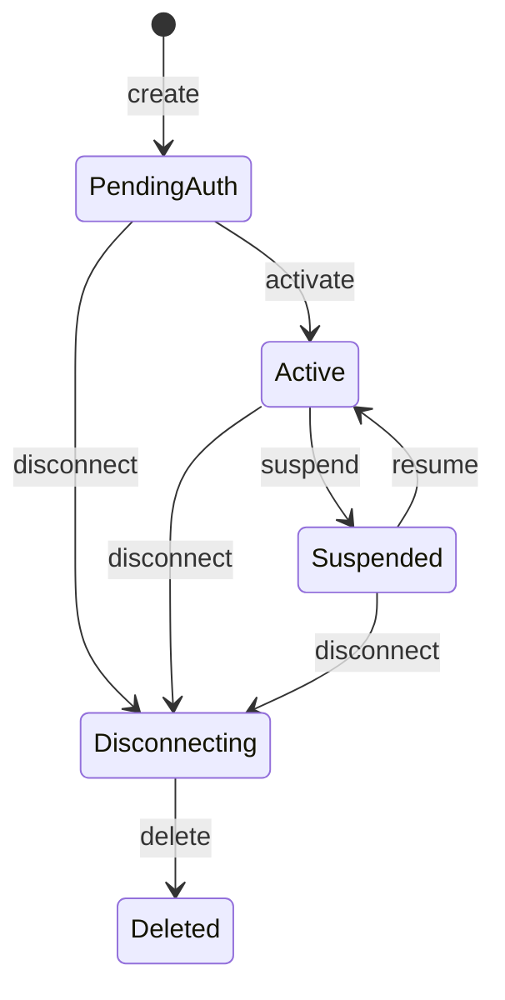

# 24 — Connectors And Connections

_Reviewed custom HTTP actions, tenant connection lifecycle, credentials, and
the boundary with Nango/Merge knowledge sync._

## Purpose

MOA connectors expose governed actions against reviewed HTTP API endpoints. A
connector is an immutable definition plus a tenant-owned connection pinned to
that definition. It is not an arbitrary model-authored request, an outbound MCP
server, or a generic knowledge-ingestion adapter.

Tenant knowledge sync is a separate provider surface. Nango and Merge use
closed code-owned managed connector parents so connection identity, lifecycle,
and credentials remain consistent, while provider records, ACLs, cursors, and
ingestion stay owned by `moa-knowledge`.

The design keeps three concerns separate:

1. a **definition** describes reviewed HTTP transport, schemas, policy floors,
   and named credential slots;
2. a **connection** binds one tenant to that exact definition, fixed
   destination, lifecycle, health, and credential series; and
3. an **action binding** makes one reviewed HTTP operation eligible for a
   governed agent catalog at one exact connection generation.

## Canonical Terms And Owners

| Term or concern | Meaning | Canonical owner |
|---|---|---|
| Connector definition | Immutable HTTP-only `ConnectorDefinition` inside one exact released artifact revision | `moa-artifacts` |
| Connector connection | Tenant-scoped definition reference, fixed HTTP origin/configuration, generation, lifecycle, health, and creator/owner | `moa-connectors` |
| Installed action binding | Exact connection generation, action ID, compiled HTTP contract/hash, governed revision, policy minimum, and enabled state | `moa-connectors` |
| Connection repository and invocation ledger | Tenant-RLS persistence, generation compare-and-swap, HTTP send boundary, and terminal outcome | `moa-connectors` |
| Managed knowledge parent | Closed code-owned `knowledge:nango@1` or `knowledge:merge@1` connection parent | `moa-connectors` |
| Artifact release | Validation, review, immutable revision history, and serving/activation pointers | `moa-artifacts` |
| Credential contract | Shared `CredentialVault` trait and non-serializable/redacted plaintext carrier | `moa-core` |
| Credential persistence | Versioned tenant/connection/slot/kind series and append-only resolution audit | `moa-auth-providers` |
| Destination admission | Canonical HTTPS origin validation, DNS admission/pinning, and fresh no-proxy/no-redirect clients | `moa-security` |
| Governed tool projection | Ephemeral tenant/identity/agent-scoped connector action catalog and dispatch | `moa-hands`, composed by `moa-orchestrator` |
| Nango/Merge knowledge | Linked accounts, provider records, cursors/deletions, ACL capture, parsing, and ingestion | `moa-knowledge` |
| Public composition | Authentication context, authorization, wire translation, private credential ingress, and Restate boundaries | `moa-edge`, `moa-orchestrator` |

`moa-connectors` does not depend on `moa-hands`, `moa-knowledge`, `moa-wire`,
`moa-edge`, or `moa-orchestrator`. `moa-knowledge` imports neither
`moa-connectors` nor `moa-artifacts`. The orchestrator composes the independently
owned services; it does not duplicate connector or knowledge domain policy.

## Definitions And Actions

An authored connector definition is HTTP-only and must declare between one and
64 actions. Each action contract fixes:

- a reviewed HTTP method and origin-relative path template;
- closed path, query, and JSON body mappings from schema-validated input;
- input and output JSON schemas;
- request, response, and timeout bounds;
- declared data classes and retry semantics;
- explicit idempotency behavior and, when applicable, a reviewed idempotency
  header; and
- at most the named credential slot declared by the definition.

Authentication is `none`, a named bearer slot, a named safe API-key header, or
a platform-managed OAuth slot supported by trusted host code. The definition
contains no credential material. A Draft artifact is never executable;
artifact release and connection activation are separate reviewed boundaries.
Connector authors do not repeat policy constants: compilation and tool
projection supply `external_write`, `high`, and `admin_review` for every custom
HTTP action.

Custom connector definitions do not describe MCP operations or knowledge
sources. Operator-owned deployment MCP remains configured independently in
`MOA_MCP_SERVERS_JSON`, and inbound `/mcp` remains an API adapter into MOA. See
[Hands And MCP](06-hands-and-mcp.md).

## Lifecycle And Health

Lifecycle is an operator-controlled, generation-fenced state machine:



- `pending_auth` is installed but not catalog eligible.
- `active` is the only lifecycle eligible for new action projection.
- `suspended` retains definition, configuration, credential history, and audit
  while refusing new work.
- `disconnecting` fences new work while remote and local teardown proceeds.
- `deleted` is a retained terminal connection record.

Every lifecycle mutation carries the caller's observed generation. Credential
activation also advances the secret-free generation fence, so old and
in-flight action pins are never mutated in place.

Health is a separate observation:

| Health | Meaning |
|---|---|
| `pending` | No conclusive readiness observation exists |
| `ready` | Local admission and any reviewed remote verification succeeded |
| `degraded` | A known impairment exists |
| `unavailable` | The connection cannot currently serve calls |
| `quarantined` | Destination or security policy isolated the connection |

Quarantine is sticky and excludes the connection from new catalogs. Recovery
requires correcting the reviewed destination or credentials and completing the
supported verification/activation path; there is no caller-supplied “clear
quarantine” override.

## Authorization And Catalog Eligibility

OpenFGA object type `connector_connection` owns two computed relations:

- `manage` is the direct owner or a tenant administrator;
- `use` is a direct operator/agent/contact grant or inherited `manage`.

Management handlers perform delegated `Manage` authorization. Catalog and
dispatch paths perform delegated `Use` authorization before protected reads and
again before credentials or network I/O. Direct `Use` grants are stored in a
tenant-RLS desired-state registry whose transactional authz outbox also makes
connection deletion enqueue every inverse tuple without network enumeration.

A connection ID or model-visible name is never authority. An action is catalog
eligible only when all of these are true:

```text
released exact definition revision
+ lifecycle == active
+ health != quarantined
+ enabled binding at the current connection generation
+ delegated connector_connection#use
+ exact agent connector binding
+ reviewed action-policy result at or above every intrinsic floor
+ matching definition, binding, generation, and compiled-contract pins
```

The deployment tool catalog remains immutable. Each authenticated request builds
an ephemeral overlay from authoritative identity and exact agent bindings.
Generated `conn__...` names are deterministic lookup references; runtime code
does not parse them to reconstruct authorization or connection facts.

## Invocation And Retry Boundaries

Every action call persists a one-way send boundary:

```text
reserved -> transmitting -> succeeded | failed | unknown_outcome
reserved -> failed_before_send
```

Terminal states are immutable. Reusing a replay identity with different inputs
is a conflict. Once `transmitting` is durable, a crash or ambiguous transport
failure cannot be treated as proof that no side effect occurred; generic replay
therefore never resends `transmitting` or `unknown_outcome` work.

Retries require the reviewed contract to state `Idempotent` or
`IdempotentWithKey`. A reviewed HTTP idempotency header receives the durable
tool-call identity. The platform never infers idempotency from an HTTP method or
prose. Raw upstream output is classified and secured before durable success is
recorded or the result reaches a model.

## Credentials

A credential series is identified by `(tenant, connection, slot, kind)` and has
append-only versions. Public connection responses expose only required slot
names, kinds, and readiness.

Plaintext uses one non-Restate path:

```text
PUT /v1/connectors/connections/{connection_id}/credentials/{slot_name}
  -> moa-edge authenticated, bounded opaque proxy
  -> http://moa-orchestrator:10023/internal/v1/connectors/credentials/write
  -> stage -> connection-generation fence -> exact-predecessor activation CAS
```

The request contains secret-free metadata plus `material`. Tenant and caller
identity come only from authenticated edge context. The private deserialize-only
secret wrapper implements neither serialization, cloning, nor debug output, so
plaintext cannot enter a Restate journal, wire response, trace field, or model
payload.

Concurrent rotations leave one active winner. Exact rollback can revoke only
the candidate it installed and restore only its recorded non-revoked
predecessor. Ordinary disconnect revokes every version while preserving history
and audit. Only bounded tenant purge may delete credential versions and the
permitted audit projection.

Nango and Merge may reuse the same vault owner through their closed service
actors. That does not turn their provider sync into a custom connector action.

## Destination Security

Production connector HTTP uses `OutboundHttpPolicy::production*`:

1. accept exactly one canonical HTTPS origin with no path, query, fragment,
   user information, wildcard, or noncanonical host spelling;
2. resolve the reviewed origin for the current attempt and reject the complete
   answer set if any address is private, loopback, link-local, metadata,
   multicast, reserved, or otherwise non-public;
3. pin that answer set into a newly constructed client for exactly one attempt;
4. disable environment/system proxies, redirects, and automatic retries; and
5. repeat authorization, generation loading, admission, credential resolution,
   and the final lifecycle/generation check for every retry.

Destination admission precedes credential resolution and header injection.
Persisted errors and telemetry contain bounded stable codes, never origins,
hosts, addresses, upstream bodies, or credential-derived text. Plain HTTP
loopback exists only under `cfg(test)` or the explicit `test-support` feature.

## Knowledge Boundary

Generic custom connector knowledge sources are not supported. Tenant knowledge
uses the linked Nango and Merge providers described in
[Tenant Knowledge Base](21-tenant-knowledge-base.md).

The code-owned definitions `knowledge:nango@1` and `knowledge:merge@1` claim
generic connector parents so `KnowledgeConnection.connection_uid` has the same
tenant-scoped parent identity. These managed parents expose no action binding
and cannot be mutated through generic connector management. Nango/Merge link,
sync, webhook, source selection, ACL capture, content fetch, and disconnect
remain provider-owned knowledge operations.

The tenant-scoped knowledge repository is exposed through six separate
`moa-knowledge` ports: connection/link, sync, ingestion, ACL, contact-group, and
provider-event persistence. Provider records carry a typed materialization
intent (inline, provider fetch, URL fetch, or metadata-only) so ingestion never
guesses from arbitrary provider JSON or silently substitutes title-only content.

## Public Management API

All routes derive tenant and caller identity from authentication and are dark unless
`MOA_EDGE_CONNECTOR_MANAGEMENT_ENABLED=true`.
Detail and mutation routes reject query parameters. The list route accepts only
an exclusive UUID `cursor` and a `limit` in `1..=100`; it defaults to 50,
orders by UUID ascending, omits deleted records, and returns the last visible
UUID as `next_cursor` only when another page exists.

| Route | Purpose |
|---|---|
| `POST /v1/connectors/connections` | Create a pending connection to one exact released HTTP connector definition |
| `GET /v1/connectors/connections?cursor=<uuid>&limit=<1..100>` | List one page of authorized non-deleted tenant connections |
| `GET /v1/connectors/connections/{connection_id}` | Read secret-free state, health, generation, and slot readiness |
| `POST /v1/connectors/connections/{connection_id}/verify` | Run destination and credential readiness plus an explicitly reviewed remote verification contract, when present |
| `POST /v1/connectors/connections/{connection_id}/activate` | Install reviewed HTTP action bindings and activate the expected generation |
| `POST /v1/connectors/connections/{connection_id}/suspend` | Fence new work while retaining configuration, credentials, bindings, and audit |
| `POST /v1/connectors/connections/{connection_id}/resume` | Return a suspended expected generation to Active |
| `POST /v1/connectors/connections/{connection_id}/disconnect` | Begin audit-preserving teardown |
| `POST /v1/connectors/connections/{connection_id}/delete` | Complete the allowed terminal deletion transition |
| `POST /v1/connectors/connections/{connection_id}/use/grant` | Grant direct same-tenant `Use` to an operator, agent, or contact |
| `POST /v1/connectors/connections/{connection_id}/use/revoke` | Revoke one direct `Use` relationship |
| `PUT /v1/connectors/connections/{connection_id}/credentials/{slot_name}` | Rotate one exact declared slot through private ingress |

Lifecycle and credential writes use expected-generation fences. Generic
management rejects code-owned Nango/Merge parents; the knowledge link workflow
owns them.

## Operator Procedures

### Keep connector management dark during rollout

The edge defaults `MOA_EDGE_CONNECTOR_MANAGEMENT_ENABLED` to `false`. While
false, the complete connector-management and credential subtree returns 404
before authentication, JSON translation, Restate forwarding, or private
credential proxying. Enable it by changing the deployment environment and
rolling `moa-edge`; no database write is required.

### Inspect and remediate a connection

1. Read `GET /v1/connectors/connections/{id}` and record the exact generation,
   lifecycle, health, bounded reason, and required-slot readiness.
2. Correct the released HTTP definition, destination, or credential as needed,
   then run `verify` against the observed generation.
3. `unverified` means local destination and credentials passed but the
   definition has no reviewed remote auth probe; it does not claim upstream
   authentication succeeded.
4. If safe operation cannot be restored, suspend the current generation.
5. Re-read after every command because credential activation advances the
   generation.

Use the management response, credential audit, action invocation rows, and
structured connector traces as evidence.

### Development reset checkpoint

This refactor is a hard reset with no compatibility decoder for legacy connector
artifacts, direct experiment requests, old Restate journals, or pre-refactor
knowledge state. Rebuild local Postgres from the complete `V000001..V000053`
chain and start with fresh Restate durable state before live validation. The
fresh-install epoch omits the unused per-user token-vault tables entirely; V29
is a no-op marker preserving contiguous numbering, and V53 moves
constrained-HTTP origin out of untyped JSON into the connector connection column
and enforces definition-kind/origin consistency. Any checksum divergence
requires rebuilding Postgres and resetting Restate rather than an in-place
upgrade. Production migration of old artifacts or durable journals would
require a separate reviewed rollout.

### Safe rollback

Suspend affected exact generations before setting
`MOA_EDGE_CONNECTOR_MANAGEMENT_ENABLED=false` and rolling the edge. The dark
switch prevents new public activation and credential writes; suspension
prevents installed connections from starting new work.

Rollback does not delete action bindings, credentials, credential audit, or
invocation evidence. In-flight actions retain their exact
definition/binding/generation/contract pins. Restoring binaries from before the
hard-reset epoch requires restoring matching Postgres and Restate snapshots;
mixed migration checksums are rejected.
